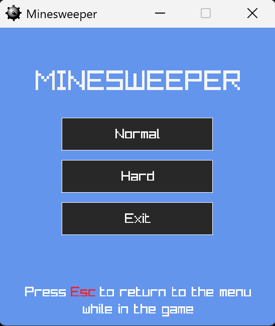
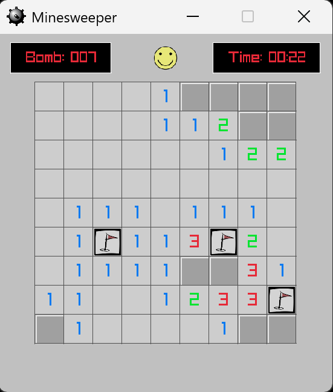
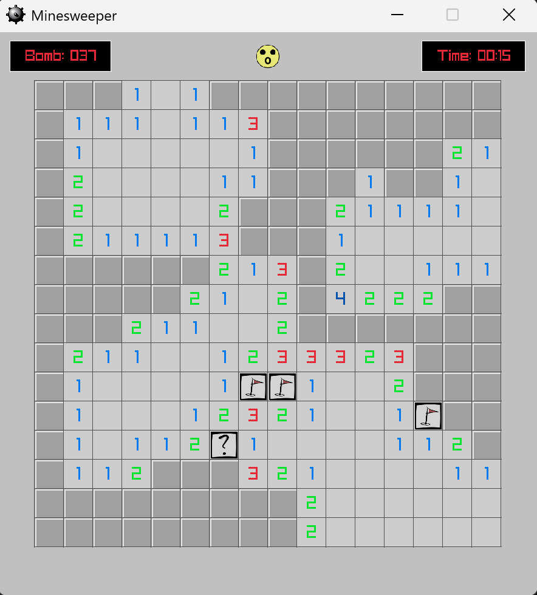

# MineSweeper

A MineSweeper developed in C++ using Visual Studio 2022  
External library used: Raylib

### Features

- Normal and Hard modes
- Right-click to place a flag or mark a question
- Top-left shows remaining mines, top-right shows the timer
- Support 4 face icons; click the face to restart after a win or loss

### Screenshots
 

  
   
  <strong>Main Menu</strong>
    
  
   
  <strong>Normal Mode</strong>
    
  
   
  <strong>Hard Mode</strong>

  
